# fast-strip-ansi

A performance-optimized ANSI escape sequence stripper, built on top of the
[`vt-push-parser`](https://docs.rs/vt-push-parser) crate.

Full VT-100/ANSI support.

No startup cost for regex compilation.

## Usage

```rust
use fast_strip_ansi::*;
let input = b"Hello, world!\x1b[31m\nHello, world!\x1b[0m";
assert_eq!(strip_ansi_bytes(input), b"Hello, world!\nHello, world!".as_slice());
let input = "Hello, world!\x1b[31m\nHello, world!\x1b[0m";
assert_eq!(strip_ansi_string(input), "Hello, world!\nHello, world!");
```

## Security and Correctness

`fast-strip-ansi` is correct and secure. It contains a true VT-100/ANSI state
machine which handles corner cases not handled by other crates.

## Performance

`fast-strip-ansi` the fastest and most correct library for stripping ANSI escape
sequences.

Note that `fast-strip-ansi` has wider support for ANSI escape sequences than
most crates but is still the fastest option.

It is significantly faster than `strip-ansi` and `strip-ansi-escapes` in all
modes.

```mermaid
xychart
    title "Performance"
    x-axis [fast-strip-ansi, fast-strip-ansi-callback, strip-ansi, strip-ansi-escapes]
    y-axis "Time (in µs)" 0 --> 100
    bar [22.12, 11.26, 39.05, 292.5]
    bar [11.89, 6.841, 19.21, 277.4]

%% Your markdown viewer may not render the chart correctly.
%% View in a mermaid chart viewer like <https://mermaid.live>
```



### Raw performance data:

_from `cargo bench` on an M3 MacBook Pro_

_0 suffix means no ansi content, 100 means significant ansi content_

| comparison                         | fastest  | median   |
| ---------------------------------- | -------- | -------- |
| fast_strip_ansi_crate_0            | 6.54 µs  | 6.937 µs |
| fast_strip_ansi_crate_100          | 18.7 µs  | 19.14 µs |
| fast_strip_ansi_crate_bytes_0      | 6.624 µs | 6.707 µs |
| fast_strip_ansi_crate_bytes_100    | 10.83 µs | 10.95 µs |
| fast_strip_ansi_crate_callback_0   | 6.333 µs | 6.416 µs |
| fast_strip_ansi_crate_callback_100 | 10.37 µs | 10.66 µs |
| strip_ansi_crate_0                 | 15.33 µs | 15.95 µs |
| strip_ansi_crate_100               | 23.54 µs | 26.47 µs |
| strip_ansi_escapes_crate_0         | 235.9 µs | 257.9 µs |
| strip_ansi_escapes_crate_100       | 241.8 µs | 269.1 µs |

Crate versions:

| crate              | version |
| ------------------ | ------- |
| fast-strip-ansi    | latest  |
| strip-ansi         | 0.1.0   |
| strip-ansi-escapes | 0.2.1   |
