```mermaid
xychart
    title "Performance"
    x-axis [fast-strip-ansi, fast-strip-ansi-callback, strip-ansi, strip-ansi-escapes]
    y-axis "Time (in µs)" 0 --> 100
    bar [22.12, 11.26, 39.05, 292.5]
    bar [11.89, 6.841, 19.21, 277.4]

%% Your markdown viewer may not render the chart correctly.
%% View in a mermaid chart viewer like <https://mermaid.live>
```

# fast-strip-ansi

A performance-optimized ANSI escape sequence stripper.

Full VT-100/ANSI support.

No startup cost for regex compilation.

## Usage

```rust
let input = b"Hello, world!\x1b[31mHello, world!\x1b[0m";
let output = fast_strip_ansi(input);
```

## Security and Correctness

`fast-strip-ansi` is correct and secure. It contains a true VT-100/ANSI state
machine which handles corner cases not handled by other crates.

## Performance

`fast-strip-ansi` the fastest and most correct library for stripping ANSI escape
sequences.

Note that `fast-strip-ansi` has wider support for ANSI escape sequences than
most crates but is still the fastest option.

It is significantly faster than `strip-ansi` and `strip-ansi-escapes` in
callback and bytes mode.



Raw performance data:

_from `cargo bench` on an M3 MacBook Pro_

| comparison                         | fastest  | slowest  | median   | mean     |
| ---------------------------------- | -------- | -------- | -------- | -------- |
| fast_strip_ansi_crate_0            | 6.54 µs  | 85.7 µs  | 6.937 µs | 11.89 µs |
| fast_strip_ansi_crate_100          | 18.7 µs  | 77.12 µs | 19.14 µs | 22.12 µs |
| fast_strip_ansi_crate_bytes_0      | 6.624 µs | 25.04 µs | 6.707 µs | 7.274 µs |
| fast_strip_ansi_crate_bytes_100    | 10.83 µs | 26.95 µs | 10.95 µs | 11.28 µs |
| fast_strip_ansi_crate_callback_0   | 6.333 µs | 21.16 µs | 6.416 µs | 6.841 µs |
| fast_strip_ansi_crate_callback_100 | 10.37 µs | 34.12 µs | 10.66 µs | 11.26 µs |
| strip_ansi_crate_0                 | 15.33 µs | 129.5 µs | 15.95 µs | 19.21 µs |
| strip_ansi_crate_100               | 23.54 µs | 167.5 µs | 26.47 µs | 39.05 µs |
| strip_ansi_escapes_crate_0         | 235.9 µs | 644.2 µs | 257.9 µs | 277.4 µs |
| strip_ansi_escapes_crate_100       | 241.8 µs | 688.8 µs | 269.1 µs | 292.5 µs |

Crate versions:

| crate              | version |
| ------------------ | ------- |
| fast-strip-ansi    | latest  |
| strip-ansi         | 0.1.0   |
| strip-ansi-escapes | 0.2.1   |
